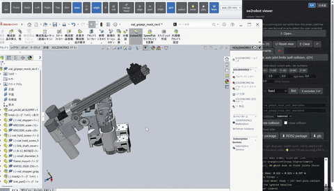

# sw2robot

[](https://github.com/jsk-ros-pkg/solidworks_urdf_exporter2/actions/workflows/ci.yml)
[](https://github.com/jsk-ros-pkg/solidworks_urdf_exporter2/releases/latest)

[](LICENSE)

[](https://github.com/jsk-ros-pkg/solidworks_urdf_exporter2/releases/latest)
[-download-000000?logo=apple&logoColor=white)](https://github.com/jsk-ros-pkg/solidworks_urdf_exporter2/releases/latest)
[-download-FCC624?logo=linux&logoColor=black)](https://github.com/jsk-ros-pkg/solidworks_urdf_exporter2/releases/latest)

> Click an OS badge to grab the latest prebuilt editor from the release page.
> Cross-platform for **edit / build / export**; the **extract** step (driving
> SolidWorks over COM) is **Windows + SolidWorks only**.

**SolidWorks → robot (URDF) converter.** Turn a SolidWorks assembly into a
URDF, then clean it up in the browser.

<p align="center">
  
</p>

One import package, with two subpackages:

- **`sw2robot.exporter`** — the exporter. `extract` opens a throwaway copy of a `.sldasm`
  in a hidden SolidWorks instance and pulls the kinematic graph + per-link
  meshes into `graph.json` (slow, Windows + SolidWorks only). `build` turns that
  `graph.json` into a URDF (fast, headless, no SolidWorks). The original CAD file
  is never modified.
- **`sw2robot.editor`** — a single-page browser editor on top of the graph: re-root the
  tree, change joint types (incl. **Shift+drag box-select** to bulk-set a range),
  edit root frames, set materials/densities, see **live self-collision** as you
  drag, **auto joint limits** from a self-collision sweep, and export a ROS /
  robot-compiler package.

## How sw2robot relates to the classic exporter

sw2robot builds on — and is inspired by — the great, long-standing
[`solidworks_urdf_exporter`](https://github.com/ros/solidworks_urdf_exporter)
SolidWorks add-in. The two tools solve the same first mile differently, and they
**compose** rather than compete:

- **The kinematic tree is inferred, not hand-built.** The classic add-in asks you
  to lay out the link hierarchy and set each joint's origin and axis by hand
  inside SolidWorks. sw2robot instead **reads the assembly's existing mates
  (constraints)** to infer the link tree and joint axes automatically — then lets
  you correct anything it got wrong in the browser editor, rather than building it
  from scratch.
- **Editing is cross-platform.** Only the *extract* step needs Windows +
  SolidWorks; *edit / build / export* run natively on Windows, macOS, and Linux
  from a single prebuilt binary — no SolidWorks and no Python.
- **It also edits URDFs the classic exporter produced.** Already exporting with
  the classic add-in? Open that `.urdf` in sw2robot's editor to re-root the tree,
  retype joints, add limits/mimic, place end-coord frames, and re-export a ROS
  package. sw2robot works on *any* URDF, not only its own output.

Which one fits depends on your workflow, not on which is "better":

| | classic `solidworks_urdf_exporter` | sw2robot |
| --- | --- | --- |
| Extract (assembly → URDF) | Windows + SolidWorks | Windows + SolidWorks |
| Link tree & joint axes | set by hand in SolidWorks | inferred from mates, then edited |
| Edit / build / export | inside SolidWorks (Windows) | Windows / macOS / Linux |
| Edit an existing URDF | — | ✓ (any URDF, not just its own) |
| Install | SolidWorks add-in | single prebuilt binary (no Python) |

## Quick start — download the Windows `.exe` (no Python)

If you just want to convert a SolidWorks assembly, you don't need to install
Python or clone this repo. Grab the prebuilt editor and run it:

1. **Download.** Go to the
   [latest release](https://github.com/jsk-ros-pkg/solidworks_urdf_exporter2/releases/latest)
   and download `sw2robot-web-windows-x64-v<version>.exe` (under *Assets*).
   It's a single self-contained file — nothing to install.
2. **Run it.** Double-click the `.exe`. A console window opens, a local server
   starts, and your default browser opens the editor at
   `http://localhost:8090` automatically.
   - Windows SmartScreen may warn that the publisher is unknown (the binary is
     unsigned). Click **More info → Run anyway**.
   - To pick a different port or skip auto-opening the browser, run it from a
     terminal: `sw2robot-web-windows-x64-v<version>.exe --port 8090 --no-browser`.
3. **Extract a robot.** Open your `.sldasm` assembly with the in-app file
   picker — the **🗄 file browser** (lists SolidWorks' recent files for
   one-click access) or **📋 paste a full path**. SolidWorks needs the real
   on-disk path to resolve referenced parts, which a browser never exposes for
   a drag-and-dropped file, so the editor opens by path rather than by drop.
   The app drives a hidden SolidWorks instance to pull the kinematic graph +
   meshes. Your original CAD file is never modified. Extracted packages are
   written to `%TEMP%\sw2robot\output`.
   - **The extract step needs SolidWorks installed on the same machine** — the
     app talks to it over COM; it does not embed SolidWorks.
   - No SolidWorks? You can still open and edit an already-extracted package,
     and the build / export steps work without it.
4. **Clean it up.** In the editor: re-root the tree, set joint types
   (Shift+drag to bulk-set a range), edit the root frame, set materials and
   densities, watch live self-collision as you drag joints, and run the
   auto joint-limit sweep.
5. **Export.** Export a ROS / robot-compiler package (URDF + meshes + configs)
   from the editor, ready to drop into your workspace.

Closing the console window stops the server and tears down the SolidWorks
instance it spawned.

## Quick start — macOS / Linux (no SolidWorks)

SolidWorks does not run on macOS / Linux, so the `extract` step (assembly →
graph) is Windows-only. **Everything else — open & edit an already-extracted
package, open & edit *any* URDF, build, and export — runs natively** on macOS
and Linux.

**Option A — download the prebuilt editor** (no Python). Grab the asset for
your OS from the [latest release](https://github.com/jsk-ros-pkg/solidworks_urdf_exporter2/releases/latest)
(under *Assets*):

**macOS (Apple Silicon)** — `sw2robot-web-macos-arm64-v<version>.zip`. Unzip it
to get `sw2robot-web.app`; double-click to launch (it opens the editor in your
browser at `http://localhost:8090`).

```bash
# Gatekeeper blocks unsigned apps on first launch — clear the quarantine once,
# then double-click, or run it from a terminal to see the server log / URL:
xattr -dr com.apple.quarantine sw2robot-web.app
./sw2robot-web.app/Contents/MacOS/sw2robot-web --port 8090
```

**Linux (x64)** — `sw2robot-web-linux-x64-v<version>` (a single binary):

```bash
chmod +x sw2robot-web-linux-x64-v<version>          # mark it executable once
./sw2robot-web-linux-x64-v<version> --port 8090     # opens http://localhost:8090
```

The binary is frozen against GLIBC 2.35, so it runs on **Ubuntu 22.04 or newer**
(22.04, 24.04, …).  On older distros you may hit a `GLIBC_2.xx not found` error
at launch — in that case run from source (Option B below) instead.

**Option B — run from source** (see [Install from source](#install-from-source-developers)
below):

```bash
pip install -e ".[ui]"
# edit an already-extracted package, or open any URDF directly:
python -m sw2robot.editor.webserver path/to/robot.urdf --port 8090
```

The editor opens in URDF-input mode when you point it at a `.urdf` file: re-root,
retype joints, set mimic/limits/materials, add end-coord ports, and re-export a
ROS package — then closing the tab leaves your original `.urdf` untouched.

## Editor — features & keyboard shortcuts

Everything below edits the package server-side and rebuilds the URDF in place
(~0.5 s), so the viewer always shows the real exported result.

**Kinematics**

- **Make root** — pick any link and make it the base; the tree is re-rooted and
  every edge between the old and new root is flipped automatically.
- **Joint types** — toggle a joint fixed ↔ movable, or **Shift+drag** a box over
  the tree to bulk-set a whole range at once.
- **Flip axis** — reverse a joint's positive direction in one keystroke.
- **Mimic** — link follower joints to a master so they move together; set a
  **multiplier** and **offset** per follower (URDF `<mimic>`). Move the master
  and the followers track it live.
- **Delete subtree** — drop a link and everything below it.
- **Actuator & physics** — per movable joint, set `<limit>` effort/velocity and
  the optional URDF `<dynamics>` (damping/friction), `<safety_controller>`
  (soft limits, k_position, k_velocity) and `<calibration>` (rising/falling).
  Blank fields stay unset. Persisted in `joints.yaml`, so they survive a
  re-extract (or hand-edit the same keys under each joint in `joints.yaml`).

**Coordinate frames**

- **Root frame** — rotate the root about its current axes or type exact numbers;
  or click a face to **align the root** to it (origin = face center). Written as
  `root_rpy` / `root_xyz` in `joints.yaml`.
- **⊕ Port (end-coords)** — click a face to drop a named, coordinate-only link
  there with **+Z = the face normal**, then nudge it with the gizmo
  (`g` move / `r` rotate) and **Place**. Handy for end-effector, sensor, or
  mount frames. Click a magenta marker to remove one. Stored under `ports:` in
  `joints.yaml`.

**Authoring aids** — live self-collision highlight as you drag a joint, an
**auto joint-limit** sweep, per-link materials/densities, a `tf` view (frame
triads + parent links), and a sizeable ground grid.

**Navigation** — left-drag orbits, right-drag pans, the wheel dollies right into
the assembly so you can inspect internal parts. **Double-click a link** to make
it the orbit centre (then orbit and zoom around that part); press **`v`** to
recentre the orbit on it, or **`c`** for a full view reset.

**Keyboard shortcuts** (with a link selected or hovered):

| Key | Action |
| --- | --- |
| `t` | toggle joint **fixed ↔ movable** |
| `f` | **flip** the joint axis / direction |
| `m` | start **mimic** linking (then click followers · `Enter`/`m` apply · `Esc` cancel) |
| `r` / `R` | **make root** at this link |
| `Del` / `Backspace` | delete the link **+ its subtree** |
| `0` / `Home` | reset **pose** (all joints to 0) |
| `c` | reset the **view** (pose, iso camera, orbit back on the model) |
| `v` | **recentre** the orbit on the focused link (or model), keeping your angle/zoom |
| `Esc` | clear selection / cancel the current mode |
| `click` · `dbl-click` · `Shift+drag` | select · **focus** (orbit around it + jump to its tree row) · box-select a range |
| mouse | left-drag orbit · right-drag pan · wheel zoom (dollies right inside the model) |

In a port/end-coords placement session the gizmo owns the keys: `g` move,
`r` rotate, `Esc` cancel.

## Install from source (developers)

Prefer this if you want to hack on sw2robot or run it on a non-Windows machine
(view / edit / build / export work anywhere; only *extract* needs Windows +
SolidWorks).

```bash
pip install -e .            # core: extract / build / web editor (view+edit)
pip install -e ".[ui]"      # + live collision highlight, auto joint-limits, viser GUI
```

`[ui]` adds `scikit-robot` (FK) and `python-fcl` (collision). The editor's
view / edit / extract / build work without it; collision and auto-limits just
report "not available" until it is installed.

## Use

**Extract a `.sldasm` -> URDF** (Windows, with SolidWorks installed):

```bash
python -m sw2robot.exporter.export path/to/assembly.sldasm -o output
```

**Open the browser editor** on an already-extracted package (no SolidWorks
needed — a sample is included):

```bash
python -m sw2robot.editor.webserver examples/fingertip --port 8090
# then open http://localhost:8090
```

From the editor you can also extract a fresh package: open a `.sldasm` with the
in-app file picker (🗄 file browser of SolidWorks' recent files, or 📋 paste a
full path) and it drives SolidWorks for you. It opens by real on-disk path —
not by browser drag-and-drop, which never exposes the path SolidWorks needs to
resolve referenced parts.

**Headless build / edit / export** (no GUI):

```bash
python -m sw2robot.editor            # see the CLI
```

## Layout

```
sw2robot/                one import package (pip install sw2robot)
  exporter/              SolidWorks -> graph.json -> URDF
  editor/                the browser editor (server + single-page web/index.html)
    _vendor/rc_config/   vendored ROS/MoveIt/Gazebo config generators
examples/fingertip/      a small pre-extracted package to try the editor offline
tests/                   pytest (sw2robot.exporter classification) + tests/e2e (puppeteer UI suite)
```

## Tests

```bash
PYTHONPATH= pytest                       # sw2robot.exporter unit tests
cd tests/e2e && npm i && node run.mjs    # UI suite (needs a running sw2robot-web + Chrome)
```

Some pytest fixtures expect a cached `output/<pkg>/graph.json`; those skip when
absent.

## License

[Apache License 2.0](LICENSE) © 2026 Iori Yanokura
